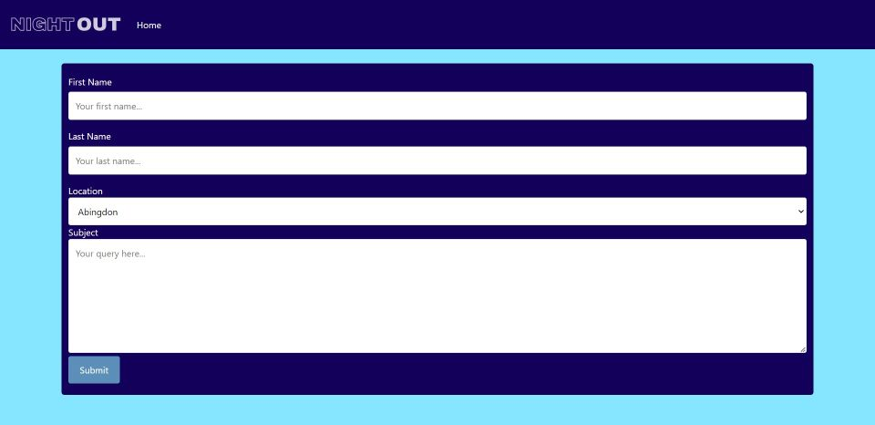

# Night Out
  
## Description 
  
Night out helps users create the perfect night out by hosting all their plans in one place.

You've heard of event planners? Well this is your free NIGHT OUT planner. It helps you find out when and where your favourite artist is playing and then instantly recommends accomodation and restaurants local to the venue. Bringing your plans together in a few easy clicks ensuring you have the best night out. **React | Javascript | HTML | Tailwind | Netlify**

---
## Table of Contents

* [Description](#description)
* [Installation](#installation)
* [Usage](#usage)
* [Technology](#technology)
* [License](#license)
* [Contributors](#contributors)
* [Credits](#credits)
* [Questions](#questions)

---
## Installation

- Clone repo

        git clone https://github.com/AnnaGilthorpe/night-out.git

- Initialize npm and install dependencies

        npm install

- Run application in command line

        npm start

---
## Usage

Nicola, James's friend, is a huge Sparks fan. She has bought tickets for every one of their European gigs but is now spending alot of time researching places to stay in the same city.

With Night Out Nicola can:-

Search for the Sparks gig in the location she wishes Buy her tickets
Peruse the available accomodation local to that venue
Book her accomodation

It is done when:-

Nicola sees her tickets options for each city
Nicola sees her accomodation for each city

### Repository

* The URL of the GitHub repository: 
[https://github.com/AnnaGilthorpe/night-out.git](https://github.com/AnnaGilthorpe/night-out.git)

* The URL of Night-Out netlify deployment : 
[https://spectacular-cassata-ebbb20.netlify.app/](https://spectacular-cassata-ebbb20.netlify.app/)

### Screenshots/Demo

---
## Technology

- HTML
- CSS
- JavaScript
- React
- Tailwind
- Ticketmaster API
- Booking.com API
- theForkTheSpoon API

Our market research revealed a real world problem in the form of the lack of an app which combined the ability to book concert tickets and then book accomodation in the area local to the concert venue. We set out to do this by using Ticketmaster's API combined with Airbnb's API. Unfortunately, Airbnb are very precious about who uses their API, so we eventually decided to use Booking.com's API via the website Rapidapi.com.

The process is in small steps: first choose the area you wish to see your favourite band in; then search for the name of the band or artist you wish to see. If your chosen artist is performing on that area in the near future, then this information is returned from the Ticketmaster API and you can click through and purchase tickets from Ticketmaster.

Should the journey to see your chosen act be a long one, the option is on the same page to search for accomodation in the vicinity of the concert venue. There is a calendar facility for the user to specify checking in and checking out dates.

There is also an option, for users that do not have specific band in mind, to 'Find Artists' playing in the location the user has selected.

The location search is saved via local storage and added to a button on the homepage to make it easy for users to come back to on their next use of the site.

---
## License

This application is covered under: **The MIT License**. Learn more about [choosing licenses](https://choosealicense.com/licenses/).

---
## Contributors

When contributing to this repository, please first discuss the change you wish to make via email, issue, linkedIn or any other method with the owner of this repository before making a change. 

### Pull Request Process

1. Fork the repository

2. Create a feature branch.

        git checkout -b name/feature/new-feature

3. Add and commit your changes.

        git add .
        git commit -m "short description of feature"

4. Push your contribution to the created branch.

        git push

5. Submit a new Pull Request on GitHub.

---
## Credits

- [Learn about path.js](https://nodejs.org/api/path.html#pathjoinpaths)

---
## Questions

Got any additional questions/enquiries? Reach out to:

- [Anna Gilthorpe](https://github.com/AnnaGilthorpe)
- [Ashey Cook](https://github.com/ashcookdev)
- [James Fahey](https://github.com/bertiemoogle)
- [Tobi Olajide](https://github.com/Thorbieey)